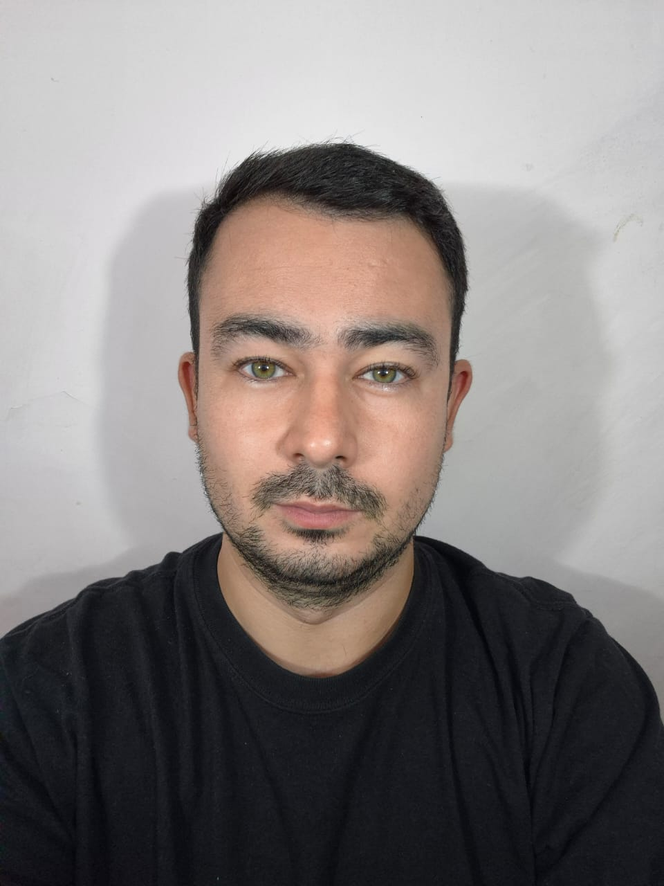

### Información Personal
- **Nombre completo:** Mariano Javier Nakazato
- **Legajo:** 153.990-5

---

### Sobre mí
Además de esta materia, actualmente estoy cursando **Tecnologías de la Automatización** e **Investigación Operativa**. 

En distintos momentos tuve que priorizar responsabilidades laborales y familiares por sobre la facultad, pero sigo con el objetivo firme de recibirme de ingeniero. Considero que la perseverancia es una de mis mayores virtudes.

En mis ratos libres, trato de desconectar **jugando al fútbol** o **escuchando música**.

### Objetivo Profesional
Actualmente me estoy interiorizando en las tareas y responsabilidades de un **Analista Funcional**. Mi meta es poder tener una experiencia laboral en este rol, donde pueda aplicar tanto los conocimientos de la facultad como los que voy aprendiendo por mi cuenta.
